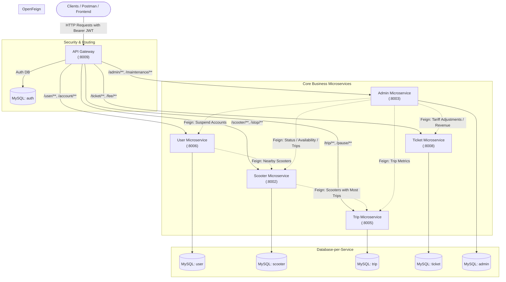

# Sistema de Gestión de Monopatines Eléctricos - Microservicios


Trabajo Práctico Especial de la cátedra **Arquitectura Web** (TUDAI - Facultad de Ciencias Exactas, UNICEN).  
Sistema distribuido basado en arquitectura de microservicios para la gestión integral de un servicio de movilidad urbana compartida con monopatines eléctricos.

---

## 📋 Tabla de Contenidos
- [Descripción General](#-descripción-general)
- [System Architecture](#-system-architecture)
- [Microservices and Ports](#-microservices-and-ports)
- [Requisitos Previos](#-requisitos-previos)
- [Configuración de Base de Datos](#-configuración-de-base-de-datos)
- [Compilación y Ejecución](#-compilación-y-ejecución)
- [Seguridad y Autenticación (JWT)](#-seguridad-y-autenticación-jwt)
- [Catálogo de la API REST (Endpoints)](#-catálogo-de-la-api-rest-endpoints)
- [Guía de Pruebas Paso a Paso (cURL / Postman)](#-guía-de-pruebas-paso-a-paso-curl--postman)
- [Documentación Swagger / OpenAPI](#-documentación-swagger--openapi)

---

## 💡 Descripción General

El sistema permite gestionar un ecosistema completo de alquiler de monopatines eléctricos:
- **Gestión de Monopatines y Paradas**: Registro, ubicación geográfica (latitud/longitud), disponibilidad, nivel de batería y asignación a estaciones/paradas autorizadas.
- **Gestión de Usuarios y Cuentas**: Registro de usuarios, asociación a cuentas con saldo monetario y cancelación/activación preventiva de cuentas.
- **Gestión de Viajes y Pausas**: Inicio, seguimiento de kilómetros y duración de viajes, registro de pausas intermedias y cálculo de tiempo de uso.
- **Tarifación y Facturación**: Emisión de tickets de cobro basados en tarifa base y tarifas adicionales por pausas prolongadas (superiores a 15 minutos).
- **Mantenimiento y Administración**: Asignación de monopatines a mantenimiento, reportes de uso con/sin pausas, métricas de monopatines más utilizados y ajuste global de tarifas vigentes.

---

## 🏛 System Architecture

The solution adopts the **Database-per-Service** pattern to guarantee strict data decoupling, an **API Gateway** as the single perimeter entry point with JWT security filtering, and synchronous inter-service communication through declarative **Spring Cloud OpenFeign** clients.



---

## 🔌 Microservices and Ports

| Microservice | Port | MySQL Database | Primary Responsibility |
|---|:---:|---|---|
| **Gateway** | `8009` | `auth` | Single entry point, JWT authentication, perimeter authorization, and dynamic reverse-proxy routing. |
| **Admin Microservice** | `8003` | `admin` | Preventive maintenance, auditing, aggregated operational reports, and global tariff management. |
| **Scooter Microservice** | `8002` | `scooter` | Scooter fleet inventory, authorized parking stations, and geo-proximity search. |
| **Trip Microservice** | `8005` | `trip` | Trip lifecycle tracking, pause interval management, and mileage/time calculation. |
| **Ticket Microservice** | `8008` | `ticket` | Automated invoice ticket generation, fee calculations, and tariff policies. |
| **User Microservice** | `8006` | `user` | User registrations, monetary balance accounts, and user-scooter associations. |

---

## 🛠 Requisitos Previos

- **Java JDK**: Versión **17** o superior (probado y compatible con JDK 17 a JDK 23).
- **Maven**: Versión **3.9+** (o el wrapper si está disponible).
- **MySQL Server**: Versión **8.0** o superior en ejecución en `localhost:3306`.

---

## 🗄 Configuración de Base de Datos

Cada microservicio cuenta con la propiedad `createDatabaseIfNotExist=true` en su cadena de conexión JDBC. Si el usuario de MySQL posee permisos de creación, las bases de datos se crearán de manera automática al iniciar cada servicio.

Credenciales predeterminadas en todos los `application.properties`:
- **Host**: `localhost:3306`
- **Usuario**: `root`
- **Contraseña**: `admin`

*(Si utilizas otra contraseña o usuario de MySQL, actualízala en los archivos `application.properties` / `application.yml` de cada microservicio o define las variables de entorno correspondientes).*

Si deseas crearlas manualmente en MySQL:
```sql
CREATE DATABASE IF NOT EXISTS auth;
CREATE DATABASE IF NOT EXISTS admin;
CREATE DATABASE IF NOT EXISTS scooter;
CREATE DATABASE IF NOT EXISTS ticket;
CREATE DATABASE IF NOT EXISTS trip;
CREATE DATABASE IF NOT EXISTS user;
```

---

## 🚀 Compilación y Ejecución

### 1. Compilación del proyecto completo
Desde la raíz del repositorio, compilar todos los microservicios con Maven:

```bash
mvn clean package -DskipTests
```

### 2. Orden de inicio recomendado
Para asegurar que los clientes OpenFeign puedan resolver las dependencias al interactuar:

1. **Bases de Datos / Servicios de negocio**:
   - `user-microservice` (Puerto 8006)
   - `trip-microservice` (Puerto 8005)
   - `scooter-microservice` (Puerto 8002)
   - `ticket-microservice` (Puerto 8008)
   - `admin-microservice` (Puerto 8003)
2. **Puerta de Enlace**:
   - `gateway` (Puerto 8009)

### 3. Cómo ejecutar cada servicio
Puedes iniciarlos desde tu IDE preferido (IntelliJ IDEA, Eclipse, VS Code) ejecutando la clase `@SpringBootApplication` de cada módulo, o desde la terminal:

```bash
# Terminal 1 - User
cd user-microservice
mvn spring-boot:run

# Terminal 2 - Trip
cd trip-microservice
mvn spring-boot:run

# Terminal 3 - Scooter
cd scooter-microservice
mvn spring-boot:run

# Terminal 4 - Ticket
cd ticket-microservice
mvn spring-boot:run

# Terminal 5 - Admin
cd admin-microservice
mvn spring-boot:run

# Terminal 6 - Gateway
cd gateway
mvn spring-boot:run
```

*(O ejecutando directamente los archivos `.jar` generados en la carpeta `target` de cada módulo).*

---

## 🔐 Seguridad y Autenticación (JWT)

El **Gateway** actúa como servidor de autenticación y filtro perimetral. Todas las peticiones a la API deben pasar a través del Gateway (`http://localhost:8009`).

### Cuentas y Roles Preconfigurados
Al arrancar el Gateway por primera vez, `DataInitializer` inicializa automáticamente las autoridades y usuarios de prueba:

| Usuario | Contraseña | Roles Asignados | Acceso Permitido |
|---|---|---|---|
| **admin** | `admin123` | `ADMIN`, `USER` | Acceso total a administración, mantenimiento y operaciones de usuario. |
| **user** | `user123` | `USER` | Monopatines, viajes, paradas, cuentas y tickets propios. |

### Cómo Autenticarse
Envía una petición `POST http://localhost:8009/authenticate` con el payload:
```json
{
  "username": "admin",
  "password": "admin123"
}
```

Respuesta esperada:
```json
{
  "id_token": "eyJhbGciOiJIUzUxMiJ9..."
}
```

En las siguientes solicitudes a través del Gateway, incluye el token en el encabezado HTTP:
```http
Authorization: Bearer <id_token>
```

---

## 📖 Catálogo de la API REST (Endpoints)

Todas las rutas son accesibles a través del **API Gateway (`http://localhost:8009`)**:

### 1. Autenticación y Registro (`gateway`)
| Método | Endpoint | Rol Requerido | Descripción |
|:---:|---|:---:|---|
| `POST` | `/authenticate` | Público | Autentica un usuario y retorna el JWT token. |
| `POST` | `/user` | Público | Registra un nuevo usuario en el sistema de autenticación. |

### 2. Usuarios y Cuentas (`user-microservice` -> puerto 8006)
| Método | Endpoint | Rol Requerido | Descripción |
|:---:|---|:---:|---|
| `GET` | `/user` | `USER`, `ADMIN` | Obtiene todos los usuarios registrados. |
| `GET` | `/user/{id}` | `USER`, `ADMIN` | Obtiene los datos de un usuario por su ID. |
| `POST` | `/user` | `USER`, `ADMIN` | Da de alta un nuevo usuario. |
| `PUT` | `/user/{id}` | `USER`, `ADMIN` | Actualiza los datos de un usuario existente. |
| `DELETE` | `/user/{id}` | `USER`, `ADMIN` | Elimina un usuario por su ID. |
| `GET` | `/user/scooter/nearby` | `USER`, `ADMIN` | Consulta monopatines cercanos indicando `latitude`, `longitude` y `radius`. |
| `GET` | `/account` | `USER`, `ADMIN` | Obtiene todas las cuentas de saldo. |
| `GET` | `/account/{id}` | `USER`, `ADMIN` | Obtiene una cuenta por su ID. |
| `POST` | `/account` | `USER`, `ADMIN` | Crea una nueva cuenta con saldo. |
| `PUT` | `/account/{id}` | `USER`, `ADMIN` | Actualiza saldo o fecha de registro de una cuenta. |
| `DELETE` | `/account/{id}` | `USER`, `ADMIN` | Elimina una cuenta por su ID. |
| `PUT` | `/account/cancel/{id}` | `USER`, `ADMIN` | Deshabilita temporalmente una cuenta (`active = false`). |
| `PUT` | `/account/activate/{id}?userId={userId}` | `USER`, `ADMIN` | Reactiva una cuenta deshabilitada vinculada al usuario. |

### 3. Monopatines y Paradas (`scooter-microservice` -> puerto 8002)
| Método | Endpoint | Rol Requerido | Descripción |
|:---:|---|:---:|---|
| `GET` | `/scooter` | `USER`, `ADMIN` | Lista todos los monopatines. |
| `GET` | `/scooter/{id}` | `USER`, `ADMIN` | Obtiene el detalle de un monopatín por su ID. |
| `POST` | `/scooter` | `USER`, `ADMIN` | Da de alta un monopatín asociándolo a una parada. |
| `PUT` | `/scooter/{id}` | `USER`, `ADMIN` | Modifica datos del monopatín (batería, ubicación, tarifas). |
| `DELETE` | `/scooter/{id}` | `USER`, `ADMIN` | Elimina un monopatín. |
| `PUT` | `/scooter/{id}/is-available?available={bool}` | `USER`, `ADMIN` | Actualiza la disponibilidad del monopatín. |
| `PUT` | `/scooter/{id}/is-under-maintenance-status?underMaintenance={bool}` | `USER`, `ADMIN` | Actualiza el estado de mantenimiento. |
| `GET` | `/scooter/status` | `USER`, `ADMIN` | Conteo de monopatines operativos/disponibles y en mantenimiento. |
| `GET` | `/scooter/nearby?latitude={lat}&longitude={lon}&radius={km}` | `USER`, `ADMIN` | Consulta monopatines en un radio determinado. |
| `GET` | `/scooter/kilometers-report/{km}` | `USER`, `ADMIN` | Lista monopatines con kilometraje menor o igual a `{km}`. |
| `GET` | `/scooter/trips/{minTrips}/{year}` | `USER`, `ADMIN` | Consulta monopatines con al menos `X` viajes en un año específico. |
| `GET` | `/stop` | `USER`, `ADMIN` | Lista todas las paradas habilitadas. |
| `GET` | `/stop/{id}` | `USER`, `ADMIN` | Obtiene una parada por su ID. |
| `POST` | `/stop` | `USER`, `ADMIN` | Crea una nueva parada con coordenadas geográficas. |
| `PUT` | `/stop/{id}` | `USER`, `ADMIN` | Actualiza el nombre o coordenadas de una parada. |
| `DELETE` | `/stop/{id}` | `USER`, `ADMIN` | Elimina una parada. |

### 4. Viajes y Pausas (`trip-microservice` -> puerto 8005)
| Método | Endpoint | Rol Requerido | Descripción |
|:---:|---|:---:|---|
| `GET` | `/trip` | `USER`, `ADMIN` | Lista todos los viajes registrados. |
| `GET` | `/trip/{id}` | `USER`, `ADMIN` | Obtiene un viaje por su ID. |
| `POST` | `/trip` | `USER`, `ADMIN` | Registra el inicio de un viaje con fecha de inicio y monopatín. |
| `PUT` | `/trip/{id}` | `USER`, `ADMIN` | Actualiza los datos de un viaje. |
| `DELETE` | `/trip/{id}` | `USER`, `ADMIN` | Elimina un viaje. |
| `PUT` | `/trip/{tripId}/finish?kilometers={km}` | `USER`, `ADMIN` | Finaliza un viaje en curso computando los kilómetros recorridos. |
| `GET` | `/trip/{tripId}/total-time-with-pauses` | `USER`, `ADMIN` | Calcula la duración total del viaje sumando los minutos de pausas. |
| `PUT` | `/trip/addPause/{id}` | `USER`, `ADMIN` | Registra una pausa vinculada al viaje. |
| `GET` | `/trip/kilometers-report` | `USER`, `ADMIN` | Reporte agrupado de kilómetros acumulados por monopatín. |
| `GET` | `/trip/scooter-with-most-trips?minTrips={min}&year={year}` | `USER`, `ADMIN` | Retorna los IDs de monopatines que alcanzaron al menos `{min}` viajes en el año `{year}`. |
| `GET` | `/pause` | `USER`, `ADMIN` | Lista todas las pausas registradas. |
| `GET` | `/pause/{id}` | `USER`, `ADMIN` | Obtiene una pausa por su ID. |
| `POST` | `/pause` | `USER`, `ADMIN` | Crea una nueva pausa. |
| `PUT` | `/pause/{id}` | `USER`, `ADMIN` | Actualiza información de una pausa. |
| `DELETE` | `/pause/{id}` | `USER`, `ADMIN` | Elimina una pausa. |

### 5. Facturación y Tarifas (`ticket-microservice` -> puerto 8008)
| Método | Endpoint | Rol Requerido | Descripción |
|:---:|---|:---:|---|
| `GET` | `/ticket` | `USER`, `ADMIN` | Lista todos los tickets emitidos. |
| `GET` | `/ticket/{id}` | `USER`, `ADMIN` | Obtiene el ticket especificado por ID. |
| `POST` | `/ticket` | `USER`, `ADMIN` | Genera un nuevo ticket de cobro. |
| `PUT` | `/ticket/{id}` | `USER`, `ADMIN` | Actualiza datos de un ticket. |
| `DELETE` | `/ticket/{id}` | `USER`, `ADMIN` | Elimina un ticket. |
| `GET` | `/ticket/total-collected?year={y}&monthStart={m1}&monthEnd={m2}` | `USER`, `ADMIN` | Calcula el total recaudado entre dos meses de un año dado. |
| `GET` | `/ticket-details` | `USER`, `ADMIN` | Lista detalles de cobro asociados a tickets. |
| `POST` | `/ticket-details` | `USER`, `ADMIN` | Agrega un desglose de viaje y tarifas a un ticket. |
| `GET` | `/fee` | `USER`, `ADMIN` | Lista todas las tarifas registradas. |
| `POST` | `/fee` | `USER`, `ADMIN` | Registra una nueva tarifa individual. |
| `POST` | `/fee/update-price?newBaseFee={b}&newExtraFee={e}&startDate={date}` | `USER`, `ADMIN` | Actualiza en lote las tarifas base y de pausa prolongada con fecha de vigencia. |

### 6. Administración y Mantenimiento (`admin-microservice` -> puerto 8003)
| Método | Endpoint | Rol Requerido | Descripción |
|:---:|---|:---:|---|
| `PUT` | `/admin/cancel/{id}` | `ADMIN` | Suspende temporalmente la cuenta de un usuario (delega vía Feign a User Service). |
| `GET` | `/admin/scooter-trip/{minTrips}/{year}` | `ADMIN` | Consulta los monopatines con al menos `X` viajes en un año específico (delega vía Feign a Scooter Service). |
| `GET` | `/admin/scooters-status` | `ADMIN` | Consulta el conteo de monopatines en operación vs. en mantenimiento. |
| `GET` | `/admin/ticket/total-collected?year={y}&monthStart={m1}&monthEnd={m2}` | `ADMIN` | Consulta la recaudación total en un período de meses. |
| `POST` | `/admin/ticket/update-prices?newBaseFee={b}&newExtraFee={e}&startDate={date}` | `ADMIN` | Ajusta los precios globales de tarifas base y extra por pausa. |
| `GET` | `/maintenance` | `ADMIN` | Lista el historial de mantenimientos. |
| `POST` | `/maintenance/start/{scooterId}` | `ADMIN` | Inicia un mantenimiento sobre un monopatín (lo desmarca como disponible y lo marca en mantenimiento). |
| `PUT` | `/maintenance/end/{scooterId}` | `ADMIN` | Finaliza el mantenimiento activo de un monopatín (lo devuelve al estado disponible). |
| `GET` | `/maintenance/report?pauses={true/false}` | `ADMIN` | Genera reporte de monopatines y kilómetros con o sin tiempos de pausa. |

---

## 🧪 Guía de Pruebas Paso a Paso (cURL / Postman)

A continuación se presenta un flujo completo para verificar la integración y el funcionamiento de punta a punta:

### Paso 1: Autenticación de Administrador
```bash
curl -X POST http://localhost:8009/authenticate \
  -H "Content-Type: application/json" \
  -d '{"username": "admin", "password": "admin123"}'
```
*Guarda el `id_token` recibido para las siguientes peticiones como `<TOKEN>`.*

---

### Paso 2: Crear una Parada
```bash
curl -X POST http://localhost:8009/stop \
  -H "Authorization: Bearer <TOKEN>" \
  -H "Content-Type: application/json" \
  -d '{
    "name": "Estación Central",
    "latitude": -37.3288,
    "longitude": -59.1367
  }'
```

---

### Paso 3: Crear un Monopatín en dicha Parada
```bash
curl -X POST http://localhost:8009/scooter \
  -H "Authorization: Bearer <TOKEN>" \
  -H "Content-Type: application/json" \
  -d '{
    "stopId": 1,
    "battery": 95.0,
    "latitude": -37.3288,
    "longitude": -59.1367,
    "kilometers": 10.5,
    "timeUsed": 45.0,
    "baseFee": 150.0,
    "extraFeePause": 25.0
  }'
```

---

### Paso 4: Crear un Usuario y una Cuenta
```bash
# Crear Usuario
curl -X POST http://localhost:8009/user \
  -H "Authorization: Bearer <TOKEN>" \
  -H "Content-Type: application/json" \
  -d '{
    "name": "Juan",
    "lastName": "Perez",
    "phoneNumber": "2494112233",
    "email": "juan.perez@example.com"
  }'

# Crear Cuenta
curl -X POST http://localhost:8009/account \
  -H "Authorization: Bearer <TOKEN>" \
  -H "Content-Type: application/json" \
  -d '{
    "balance": 2500.0,
    "registrationDate": "2026-01-15"
  }'
```

---

### Paso 5: Iniciar y Finalizar un Viaje
```bash
# Iniciar Viaje
curl -X POST http://localhost:8009/trip \
  -H "Authorization: Bearer <TOKEN>" \
  -H "Content-Type: application/json" \
  -d '{
    "scooterId": 1,
    "startDate": "2026-03-20T10:00:00",
    "kilometers": 0.0
  }'

# Finalizar Viaje (por ejemplo, ID 1 tras recorrer 4.2 km)
curl -X PUT "http://localhost:8009/trip/1/finish?kilometers=4.2" \
  -H "Authorization: Bearer <TOKEN>"
```

---

### Paso 6: Operaciones Administrativas (Rol ADMIN)

```bash
# Consultar monopatines operativos vs en mantenimiento
curl -X GET http://localhost:8009/admin/scooters-status \
  -H "Authorization: Bearer <TOKEN>"

# Enviar monopatín 1 a mantenimiento
curl -X POST http://localhost:8009/maintenance/start/1 \
  -H "Authorization: Bearer <TOKEN>" \
  -H "Content-Type: text/plain" \
  -d "Revisión de frenos y neumáticos"

# Finalizar mantenimiento del monopatín 1
curl -X PUT http://localhost:8009/maintenance/end/1 \
  -H "Authorization: Bearer <TOKEN>"

# Consultar monopatines con al menos 1 viaje en 2026
curl -X GET http://localhost:8009/admin/scooter-trip/1/2026 \
  -H "Authorization: Bearer <TOKEN>"

# Ajustar tarifas vigentes
curl -X POST "http://localhost:8009/admin/ticket/update-prices?newBaseFee=200.0&newExtraFee=30.0&startDate=2026-04-01" \
  -H "Authorization: Bearer <TOKEN>"

# Suspender temporalmente la cuenta 1
curl -X PUT http://localhost:8009/admin/cancel/1 \
  -H "Authorization: Bearer <TOKEN>"
```

---

## 📑 Documentación Swagger / OpenAPI

Gracias a la integración con `springdoc-openapi`, cada microservicio expone su documentación interactiva Swagger UI y su especificación OpenAPI v3 en sus puertos directos:

- **Gateway**: [http://localhost:8009/swagger-ui/index.html](http://localhost:8009/swagger-ui/index.html)
- **Admin Microservice**: [http://localhost:8003/swagger-ui/index.html](http://localhost:8003/swagger-ui/index.html)
- **Scooter Microservice**: [http://localhost:8002/swagger-ui/index.html](http://localhost:8002/swagger-ui/index.html)
- **Trip Microservice**: [http://localhost:8005/swagger-ui/index.html](http://localhost:8005/swagger-ui/index.html)
- **Ticket Microservice**: [http://localhost:8008/swagger-ui/index.html](http://localhost:8008/swagger-ui/index.html)
- **User Microservice**: [http://localhost:8006/swagger-ui/index.html](http://localhost:8006/swagger-ui/index.html)

---

## 👥 Autores
- Proyecto desarrollado como Trabajo Práctico Especial para **Arquitectura Web** - TUDAI - UNICEN.
